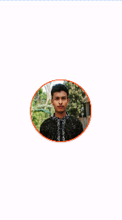

<h4>create a xml file in values Folder</h4>
<h5>for example: style.xml</h5>

```xml
<?xml version="1.0" encoding="utf-8"?>
<resources>
    <style name="roundedImage">
        <item name="cornerFamily">rounded</item>
        <item name="cornerSize">50%</item>
    </style>
</resources>
```


<h3>main_layout.xml</h3>

```xml
<?xml version="1.0" encoding="utf-8"?>
<RelativeLayout xmlns:android = "http://schemas.android.com/apk/res/android"
    xmlns:app = "http://schemas.android.com/apk/res-auto"
    xmlns:tools = "http://schemas.android.com/tools"
    android:id = "@+id/main"
    android:layout_width = "match_parent"
    android:layout_height = "match_parent"
    tools:context = ".MainActivity" >

    <androidx.cardview.widget.CardView
        android:layout_width = "205dp"
        android:layout_height = "205dp"
        android:layout_centerInParent="true"
        app:cardBackgroundColor="#FF5722"
        app:cardCornerRadius="100dp"
        >

        <com.google.android.material.imageview.ShapeableImageView
            android:layout_width = "200dp"
            android:layout_height = "200dp"
            android:id="@+id/imgeView"
            app:shapeAppearanceOverlay="@style/roundedImage"
            android:src="@drawable/your_image"
            android:layout_gravity="center"
            />

    </androidx.cardview.widget.CardView>

</RelativeLayout >

```
  
